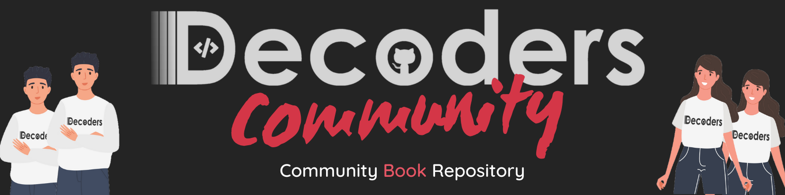
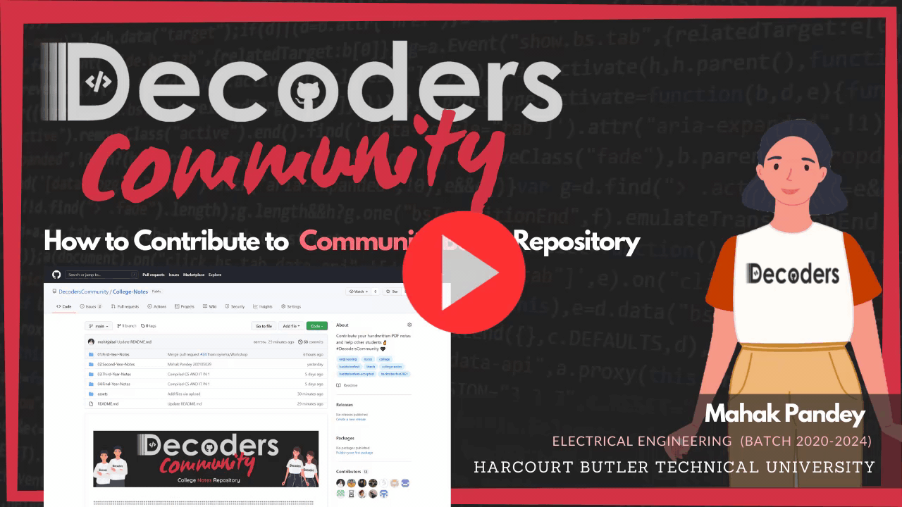

<br/>
☷☷☷☷☷☷☷☷☷☷☷☷☷☷☷☷☷☷☷☷☷☷☷☷☷☷☷☷☷☷☷☷☷☷☷☷☷☷☷☷☷☷☷☷☷☷☷☷☷☷☷☷☷☷☷☷☷
 <br/> <br/>

  <p align="center">
<a href="https://t.me/decoderscommunity">
    
  </a>&nbsp; &nbsp; &nbsp;
  <a href="https://www.linkedin.com/company/decoderscommunity">
    
  </a>&nbsp; &nbsp; &nbsp;
  <a href="https://instagram.com/decoderscommunity">
    
  </a>&nbsp; &nbsp; &nbsp;
  <a href="https://bit.ly/DecodersYoutube">
    
  </a>&nbsp; &nbsp; &nbsp;
  
 
</p>

 <p align="center">
 Do star the Decoder's Community Book repository ✨✨✨

</p>

  <br/>
☷☷☷☷☷☷☷☷☷☷☷☷☷☷☷☷☷☷☷☷☷☷☷☷☷☷☷☷☷☷☷☷☷☷☷☷☷☷☷☷☷☷☷☷☷☷☷☷☷☷☷☷☷☷☷☷☷
  <br/>  <br/>

<p align="center"><a href="https://youtu.be/KPqjTNk-kKg"></img></a></p>


☷☷☷☷☷☷☷☷☷☷☷☷☷☷☷☷☷☷☷☷☷☷☷☷☷☷☷☷☷☷☷☷☷☷☷☷☷☷☷☷☷☷☷☷☷☷☷☷☷☷☷☷☷☷☷☷☷


 <br/> <br/>


Hacktoberfest, in its 8th year, is a month-long celebration of open source software run by DigitalOcean. During the month of October, we invite you to join open-source software enthusiasts, beginners, and the developer community by contributing to open-source projects. You can do this in a variety of ways:

- Prepare and share your project for collaboration
- Contribute to the betterment of a project via pull requests
- Organize an event
- Mentor others
- Donate directly to open source projects

#

# 🚀 Contributing Guidelines

**STEP 1:** Fork this repository .


#

**STEP 2:** BASIC TEMPLATE (Just Copy the given code) .

```
## {Yourname}
- Batch: 2020-2024 {BranchName}
- Github Profile: {YourGithubProfileLink}
- Linkedin Profile: {YourLinkedinProfileLink}
```

#

**STEP 3:** Go to [**Contributors**](https://github.com/decodershbtu/Decoders-Community/tree/main/Contributors) folder .


#

**STEP 4:** Create new file and name your file as {yourname-rollno.md} eg:- **AbhishekYadav-20010401.md** then paste and edit the template .

</img>

#

**STEP 5:** Write your name and roll number in commit message and press commit changes .


#

**STEP 6:** Create your pull request to main branch & wait for review

<h3 align="center">🎉 Thanks for contributing to decoders community 🎉</h3>

## Contributors 🎉
<a href="https://github.com/DecodersCommunity/Decoders-Community/graphs/contributors">
  
</a>
